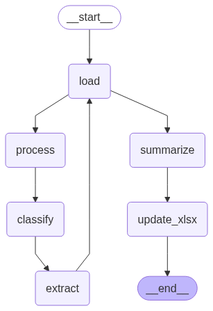

# Invoice Agent App

This application simplifies the reimbursement process for business trip invoices. It automates the workflow from scanned PDF invoices to a ready-to-submit Excel file required for reimbursement.

## What does it do?

- **Takes scanned PDF invoices** from your business trip (e.g., hotel, taxi, flight, etc.)
- **Classifies** each invoice type automatically
- **Extracts relevant information** (amount, dates, guest name, etc.) using AI and OCR
- **Creates a summary** of all expenses
- **Generates the final XLS file** in the required format for reimbursement

## Project structure

```
├── CHANGELOG.md
├── Dockerfile_Fastapi
├── Dockerfile_Streamlit
├── README.md
├── main.py
├── build_run.sh
├── Makefile
├── data
├── pyproject.toml 
├── src
│   ├── finance_analysis
│   │   ├── config
│   │   ├── resources
│   │   ├── services
│   │   └── utils
│   └── notebooks
└── app.py
```

## Agent Graph

Below is a visualization of the agent graph used in the app:



## How it works

1. **Drop your scanned PDFs** into a folder.
2. The app **processes each file**:
   - Merges PDFs if needed
   - Converts pages to images for OCR
   - Extracts text and key fields using AI models
   - Classifies the invoice type (hotel, taxi, flight, etc.)
3. **All extracted data is summarized** and mapped to the correct fields.
4. The app **fills out the official reimbursement Excel template** with all required details.

## Getting started

Create a virtual environment:
```bash
uv venv --python 3.12
uv sync
source .venv/bin/activate
```

Start the app:
```bash
make ui       
```

Format code:
```bash
make format
```

## Business context

- **Goal:** Automate and accelerate the reimbursement process for business travel expenses.
- **Input:** Scanned PDF invoices from various sources.
- **Output:** Ready-to-submit Excel file for your company's reimbursement workflow.
- **Impact:** Saves time, reduces manual errors, and streamlines the process for employees and finance teams.

