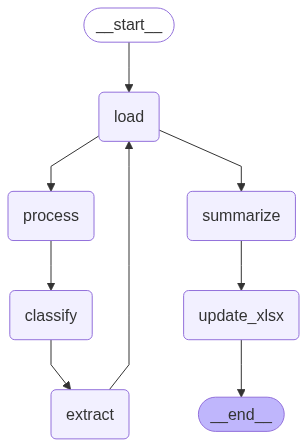

# Invoice Agent App

This application simplifies the reimbursement process for business trip invoices. It automates the workflow from scanned PDF invoices to a ready-to-submit Excel file required for reimbursement. It uses a Multi-Agent system built in LangGraph and uses Docling for Layout and Table Extraction. Document AI is used as the default OCR solution, with alternative OCR options available. For all generative tasks *Google's Gemini 2.5 Flash* is used.


## Project structure

```
├── app.py
├── data
├── docker-compose.yaml
├── invoice.Dockerfile
├── Makefile
├── pyproject.toml
├── README.md
├── src
│   ├── finance_analysis
│   │   ├── config
│   │   ├── resources
│   │   ├── services
│   │   └── utils
│   └── notebooks
├── tests
```

## Agent Graph

Below is a visualization of the agent graph used in the app:



## How it works

1. **Drop your scanned PDFs** into a folder.
2. The app **processes each file**:
   - Merges PDFs if needed
   - Converts pages to images for OCR
   - Extracts text and key fields using AI models
   - Classifies the invoice type (hotel, taxi, flight, etc.)
3. **All extracted data is summarized** and mapped to the correct fields.
4. The app **fills out the official reimbursement Excel template** with all required details.

## Usage

1. **Upload your invoices** as PDF files through the app interface
2. **Enter trip information** (name, destination, etc.)
3. **Click "Process Uploaded Files"** to start the AI processing
4. **Download the results:**
   - A pre-filled Excel reimbursement file with all expense details
   - A merged PDF containing all uploaded invoices in the order listed in the Excel file
5. **Review and edit** the downloaded files if needed
6. **Finalize your submission:**
   - Save the Excel file as PDF
   - Merge it on top of the generated PDF (Excel PDF first, then invoice PDFs)
   - Submit the complete package

## Getting started

Create a virtual environment:
```bash
uv venv --python 3.12
uv sync
source .venv/bin/activate
```

Start the app:
```bash
make ui       
```

Format code:
```bash
make format
```

## Business context

- **Goal:** Automate and accelerate the reimbursement process for business travel expenses.
- **Input:** Scanned PDF invoices from various sources.
- **Output:** Ready-to-submit Excel file for your company's reimbursement workflow.
- **Impact:** Saves time, reduces manual errors, and streamlines the process for employees and finance teams.

